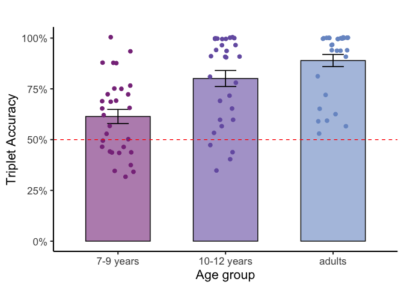
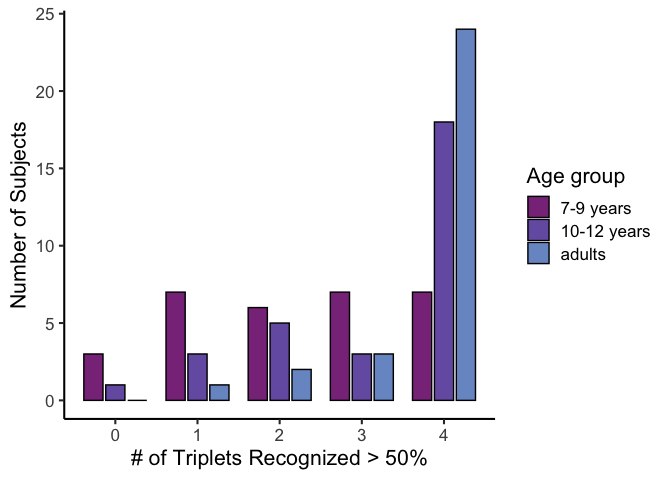

1_behavior
================
2025-12-17

``` r
master <- read.csv('clean_behavior_by_triad.csv')
```

# Behavioral analyses:

## Accuracy by age group:

``` r
# average across triplets (within subject)
data <- master %>%
  group_by(subject, age_group, scanner, sex) %>%
  summarize(across(where(is.numeric), mean, na.rm = TRUE), .groups = "drop")
```

    ## Warning: There was 1 warning in `summarize()`.
    ## ℹ In argument: `across(where(is.numeric), mean, na.rm = TRUE)`.
    ## ℹ In group 1: `subject = "temple016"`, `age_group = "adults"`, `scanner =
    ##   "skyra"`, `sex = "M"`.
    ## Caused by warning:
    ## ! The `...` argument of `across()` is deprecated as of dplyr 1.1.0.
    ## Supply arguments directly to `.fns` through an anonymous function instead.
    ## 
    ##   # Previously
    ##   across(a:b, mean, na.rm = TRUE)
    ## 
    ##   # Now
    ##   across(a:b, \(x) mean(x, na.rm = TRUE))

``` r
data <- data %>%
  mutate(age_cat = case_when(
    age < 10 ~ 'child',
    age < 13 & age >= 10 ~ 'adolescent',
    age >= 18 ~ 'adult',
    TRUE ~ NA_character_  
  ))

m <- lm(triplet_accuracy ~ age_group, data = data)
summary(m)
```

    ## 
    ## Call:
    ## lm(formula = triplet_accuracy ~ age_group, data = data)
    ## 
    ## Residuals:
    ##      Min       1Q   Median       3Q      Max 
    ## -0.45729 -0.16443  0.07354  0.11042  0.38604 
    ## 
    ## Coefficients:
    ##                    Estimate Std. Error t value Pr(>|t|)    
    ## (Intercept)         0.80104    0.03495  22.918  < 2e-16 ***
    ## age_group7-9 years -0.18708    0.04943  -3.785 0.000282 ***
    ## age_groupadults     0.08854    0.04943   1.791 0.076729 .  
    ## ---
    ## Signif. codes:  0 '***' 0.001 '**' 0.01 '*' 0.05 '.' 0.1 ' ' 1
    ## 
    ## Residual standard error: 0.1914 on 87 degrees of freedom
    ## Multiple R-squared:  0.2715, Adjusted R-squared:  0.2547 
    ## F-statistic: 16.21 on 2 and 87 DF,  p-value: 1.039e-06

``` r
emm <- emmeans(m, ~ age_group)
pairs(emm)
```

    ##  contrast                    estimate     SE df t.ratio p.value
    ##  (10-12 years) - (7-9 years)   0.1871 0.0494 87   3.785  0.0008
    ##  (10-12 years) - adults       -0.0885 0.0494 87  -1.791  0.1785
    ##  (7-9 years) - adults         -0.2756 0.0494 87  -5.576  <.0001
    ## 
    ## P value adjustment: tukey method for comparing a family of 3 estimates

### to plot above group comparison:

``` r
data <- data %>%
  mutate(age_group = factor(age_group, levels = c("7-9 years", "10-12 years", "adults")))

# summary stats (mean, SE) by age group
sum_df <- data %>%
  group_by(age_group) %>%
  summarise(
    mean_acc = mean(triplet_accuracy, na.rm = TRUE),
    se       = sd(triplet_accuracy, na.rm = TRUE) / sqrt(sum(!is.na(triplet_accuracy))),
    .groups  = "drop")

ggplot() +
  geom_col(data = sum_df,
           aes(x = age_group, y = mean_acc, fill = age_group),
           color = "black", width = 0.6, alpha = 0.6) +
  geom_errorbar(data = sum_df,
                aes(x = age_group, ymin = mean_acc - se, ymax = mean_acc + se),
                width = 0.2, linewidth = 0.6) +
  geom_jitter(data = data,
              aes(x = age_group, y = triplet_accuracy, color = age_group),
              width = 0.15, alpha = 1.0, size = 2) +
  # chance performance = 0.5
  geom_hline(yintercept = 0.5, color = "red", linetype = "dashed") +
  scale_fill_manual(values = age_cols, guide = "none") +
  scale_color_manual(values = age_cols, guide = "none") +
  labs(x = "Age group", y = "Triplet Accuracy", title = "") +
  theme_classic(base_size = 16) +
  theme(
    panel.border = element_blank()
  ) + scale_y_continuous(labels = scales::percent_format(accuracy = 1))
```

<!-- -->

## Triplets recognized \> 50% by age group

``` r
ACC_THRESH <- 0.5
age_order <- c("7-9 years","10-12 years","adults")

# 1. assign age group
subject_age <- master %>%
  group_by(subject) %>%
  summarise(age_group = dplyr::first(age_group), .groups = "drop") %>%
  mutate(age_group = factor(age_group, levels = age_order))

# 2. create one row per subject-triplet pair (w/ accuracy)
triplet_level <- master %>%
  filter(!is.na(triplet_accuracy)) %>%
  group_by(subject, triplet) %>%
  summarise(triplet_accuracy = mean(triplet_accuracy, na.rm = TRUE), .groups = "drop")

# 3. count # of triplets exceeding threshold per subject
counts_per_subject <- triplet_level %>%
  mutate(over = as.integer(triplet_accuracy > ACC_THRESH)) %>%
  group_by(subject) %>%
  summarise(n_triplets_over = sum(over, na.rm = TRUE), .groups = "drop") %>%
  left_join(subject_age, by = "subject")

# 4. generate distribution by n_triplets_over and age_group
counts <- counts_per_subject %>%
  count(n_triplets_over, age_group, name = "count") %>%
  ungroup()

# 5) pivot to wide with rows 0..4 and columns in age_order
pivot_counts <- counts %>%
  complete(
    n_triplets_over = 0:4,
    age_group = factor(age_group, levels = age_order),
    fill = list(count = 0)
  ) %>%
  pivot_wider(names_from = age_group, values_from = count) %>%
  arrange(n_triplets_over) %>%
  mutate(across(-n_triplets_over, ~ as.integer(.)))

pivot_counts
```

    ## # A tibble: 5 × 4
    ##   n_triplets_over `7-9 years` `10-12 years` adults
    ##             <int>       <int>         <int>  <int>
    ## 1               0           3             1      0
    ## 2               1           7             3      1
    ## 3               2           6             5      2
    ## 4               3           7             3      3
    ## 5               4           7            18     24

### plot above distributions for triplets recognized \> 50%

``` r
pivot_long <- pivot_counts %>%
  tidyr::pivot_longer(-n_triplets_over, names_to = "age_group", values_to = "count") %>%
  mutate(
    age_group = factor(age_group, levels = c("7-9 years", "10-12 years", "adults"))
)

ggplot(pivot_long, aes(x = n_triplets_over, y = count, fill = age_group)) +
  geom_col(position = position_dodge(width = 0.8), width = 0.7, color = "black") +
  scale_fill_manual(
    values = c("7-9 years" = "#883689",
               "10-12 years" = "#765fb0",
               "adults" = "#7998cc")
  ) +
  labs(x = "# of Triplets Recognized > 50%", y = "Number of Subjects", fill = "Age group") +
  theme_classic(base_size = 16)
```

<!-- -->

## assess continuous effect of age on accuracy within developmental group

``` r
sub <- subset(data, age < 18)

m <- lm(triplet_accuracy ~ age, data = sub)
summary(m)
```

    ## 
    ## Call:
    ## lm(formula = triplet_accuracy ~ age, data = sub)
    ## 
    ## Residuals:
    ##      Min       1Q   Median       3Q      Max 
    ## -0.46141 -0.14310  0.05129  0.12829  0.39430 
    ## 
    ## Coefficients:
    ##             Estimate Std. Error t value Pr(>|t|)    
    ## (Intercept)  0.06302    0.14733   0.428     0.67    
    ## age          0.06476    0.01459   4.439  4.1e-05 ***
    ## ---
    ## Signif. codes:  0 '***' 0.001 '**' 0.01 '*' 0.05 '.' 0.1 ' ' 1
    ## 
    ## Residual standard error: 0.1945 on 58 degrees of freedom
    ## Multiple R-squared:  0.2536, Adjusted R-squared:  0.2407 
    ## F-statistic: 19.71 on 1 and 58 DF,  p-value: 4.103e-05

``` r
sub$age2 <- sub$age^2
sub$age3 <- sub$age^3

m2 <- lm(triplet_accuracy ~ age + age2, data = sub)
summary(m)
```

    ## 
    ## Call:
    ## lm(formula = triplet_accuracy ~ age, data = sub)
    ## 
    ## Residuals:
    ##      Min       1Q   Median       3Q      Max 
    ## -0.46141 -0.14310  0.05129  0.12829  0.39430 
    ## 
    ## Coefficients:
    ##             Estimate Std. Error t value Pr(>|t|)    
    ## (Intercept)  0.06302    0.14733   0.428     0.67    
    ## age          0.06476    0.01459   4.439  4.1e-05 ***
    ## ---
    ## Signif. codes:  0 '***' 0.001 '**' 0.01 '*' 0.05 '.' 0.1 ' ' 1
    ## 
    ## Residual standard error: 0.1945 on 58 degrees of freedom
    ## Multiple R-squared:  0.2536, Adjusted R-squared:  0.2407 
    ## F-statistic: 19.71 on 1 and 58 DF,  p-value: 4.103e-05

``` r
m3 <- lm(triplet_accuracy ~ age + age2 + age3, data = sub)
summary(m)
```

    ## 
    ## Call:
    ## lm(formula = triplet_accuracy ~ age, data = sub)
    ## 
    ## Residuals:
    ##      Min       1Q   Median       3Q      Max 
    ## -0.46141 -0.14310  0.05129  0.12829  0.39430 
    ## 
    ## Coefficients:
    ##             Estimate Std. Error t value Pr(>|t|)    
    ## (Intercept)  0.06302    0.14733   0.428     0.67    
    ## age          0.06476    0.01459   4.439  4.1e-05 ***
    ## ---
    ## Signif. codes:  0 '***' 0.001 '**' 0.01 '*' 0.05 '.' 0.1 ' ' 1
    ## 
    ## Residual standard error: 0.1945 on 58 degrees of freedom
    ## Multiple R-squared:  0.2536, Adjusted R-squared:  0.2407 
    ## F-statistic: 19.71 on 1 and 58 DF,  p-value: 4.103e-05

``` r
AIC(m)
```

    ## [1] -22.26108

``` r
AIC(m2)
```

    ## [1] -20.34711

``` r
AIC(m3)
```

    ## [1] -19.53007

### plot linear effect of age across full sample

``` r
ggplot(data, aes(x = age, y = triplet_accuracy)) +
  geom_point(color = "#005F86", alpha = 0.6, size = 2) +   # pale magenta points
  geom_smooth(method = "lm", se = TRUE,
              color = "#005F86", fill = "#005F86",
              alpha = 0.2, linewidth = 1.2) +              # regression line + CI band
  labs(x = "Age (years)", y = "Triplet Accuracy", title = "") +
  theme_classic(base_size = 16) +
  theme(
    panel.border = element_blank()
  ) +
  scale_y_continuous(labels = scales::percent_format(accuracy = 1)) +
  scale_x_continuous(breaks = seq(7, 35, by = 3), limits = c(7, 35)) + coord_cartesian(ylim=c(0, 1))
```

    ## `geom_smooth()` using formula = 'y ~ x'

<!-- -->
