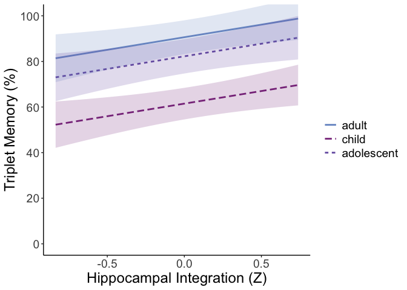
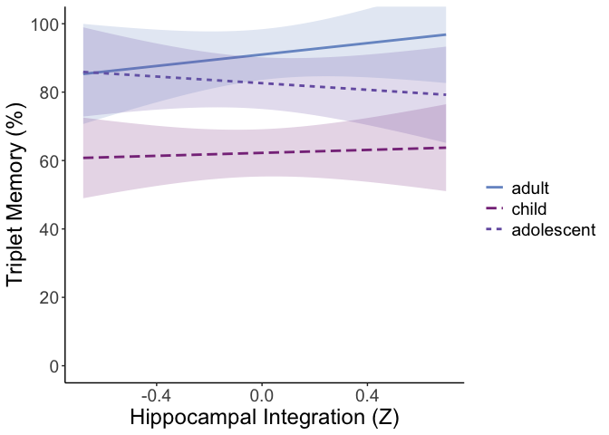

2_integration
================
2025-12-17

``` r
master <- read.csv('data/integration_data.csv')
```

# Integration analyses:

## Adjacent pair analyses - primary

``` r
data <- subset(master, roi == 'sl-AB_group_hip')
data$age_group <- relevel(factor(data$age_group), ref = 'child')

# posterior integration of adjacent pairs does not vary by age group
m <- lmer(difference ~ age_group + scanner + (1|subject), data = data)
summary(m)
```

    ## Linear mixed model fit by REML. t-tests use Satterthwaite's method [
    ## lmerModLmerTest]
    ## Formula: difference ~ age_group + scanner + (1 | subject)
    ##    Data: data
    ## 
    ## REML criterion at convergence: 17.9
    ## 
    ## Scaled residuals: 
    ##     Min      1Q  Median      3Q     Max 
    ## -3.5336 -0.5399  0.0303  0.5588  2.8190 
    ## 
    ## Random effects:
    ##  Groups   Name        Variance Std.Dev.
    ##  subject  (Intercept) 0.00113  0.03362 
    ##  Residual             0.05739  0.23956 
    ## Number of obs: 360, groups:  subject, 90
    ## 
    ## Fixed effects:
    ##                      Estimate Std. Error        df t value Pr(>|t|)   
    ## (Intercept)          0.060607   0.022931 85.999991   2.643  0.00976 **
    ## age_groupadolescent -0.024848   0.032949 85.999991  -0.754  0.45283   
    ## age_groupadult      -0.004335   0.032732 85.999991  -0.132  0.89493   
    ## scannerskyra        -0.029875   0.031432 85.999991  -0.950  0.34454   
    ## ---
    ## Signif. codes:  0 '***' 0.001 '**' 0.01 '*' 0.05 '.' 0.1 ' ' 1
    ## 
    ## Correlation of Fixed Effects:
    ##             (Intr) ag_grpdls ag_grpdlt
    ## ag_grpdlscn -0.652                    
    ## age_gropdlt -0.661  0.521             
    ## scannerskyr -0.137 -0.223    -0.192

``` r
# in all age groups, integration of adjacent pairs predicts memory at the triplet level
m <- lmer(triplet_accuracy ~ difference + age_group + scanner + (1|subject), data = data)
summary(m)
```

    ## Linear mixed model fit by REML. t-tests use Satterthwaite's method [
    ## lmerModLmerTest]
    ## Formula: triplet_accuracy ~ difference + age_group + scanner + (1 | subject)
    ##    Data: data
    ## 
    ## REML criterion at convergence: -83.9
    ## 
    ## Scaled residuals: 
    ##     Min      1Q  Median      3Q     Max 
    ## -3.5408 -0.3992  0.1476  0.4366  2.1491 
    ## 
    ## Random effects:
    ##  Groups   Name        Variance Std.Dev.
    ##  subject  (Intercept) 0.02895  0.1701  
    ##  Residual             0.02961  0.1721  
    ## Number of obs: 360, groups:  subject, 90
    ## 
    ## Fixed effects:
    ##                      Estimate Std. Error        df t value Pr(>|t|)    
    ## (Intercept)           0.61486    0.03524  86.75195  17.450  < 2e-16 ***
    ## difference            0.11041    0.04226 303.35681   2.613  0.00943 ** 
    ## age_groupadolescent   0.20755    0.05051  85.96731   4.109 9.03e-05 ***
    ## age_groupadult        0.29129    0.05016  85.90001   5.807 1.05e-07 ***
    ## scannerskyra         -0.07265    0.04819  86.00819  -1.508  0.13533    
    ## ---
    ## Signif. codes:  0 '***' 0.001 '**' 0.01 '*' 0.05 '.' 0.1 ' ' 1
    ## 
    ## Correlation of Fixed Effects:
    ##             (Intr) dffrnc ag_grpdls ag_grpdlt
    ## difference  -0.073                           
    ## ag_grpdlscn -0.652  0.021                    
    ## age_gropdlt -0.660  0.004  0.521             
    ## scannerskyr -0.139  0.026 -0.222    -0.192

### Plot adjacent pair analysis above

``` r
data$age_group <- relevel(factor(data$age_group), ref = 'adult')
m <- lmer(triplet_accuracy ~ difference + age_group + scanner + (1|subject), data = data)
interact_plot(m,
              # x variable
              pred = difference,
              # grouping variable
              modx = age_group,
              colors = c("#7998cc", "#883689", "#765fb0"),
              # confidence bands
              interval = TRUE,
              # observation-level points
              plot.points = FALSE,
              y.label = 'Triplet Memory (%)',
              x.label = "Hippocampal Integration (Z)",
              legend.main = "", vary.lty = TRUE) +
  theme_classic() +
  # scale y axis to percents
  scale_y_continuous(
    labels = function(x) x * 100,
    breaks = seq(0, 1, 0.2) 
  ) +
  # set y axis limits
  coord_cartesian(ylim = c(0, 1)) +
  theme(text = element_text(size = 18))
```

    ## Warning: difference and age_group are not included in an interaction with one
    ## another in the model.

<!-- -->

### Adjacent pair analyses - supplementary

``` r
# no age group by integration interaction
m <- lmer(triplet_accuracy ~ difference * age_group + (1|subject), data = data)
summary(m)
```

    ## Linear mixed model fit by REML. t-tests use Satterthwaite's method [
    ## lmerModLmerTest]
    ## Formula: triplet_accuracy ~ difference * age_group + (1 | subject)
    ##    Data: data
    ## 
    ## REML criterion at convergence: -82
    ## 
    ## Scaled residuals: 
    ##     Min      1Q  Median      3Q     Max 
    ## -3.6417 -0.3817  0.1590  0.4030  2.1090 
    ## 
    ## Random effects:
    ##  Groups   Name        Variance Std.Dev.
    ##  subject  (Intercept) 0.02967  0.1723  
    ##  Residual             0.02958  0.1720  
    ## Number of obs: 360, groups:  subject, 90
    ## 
    ## Fixed effects:
    ##                                 Estimate Std. Error        df t value Pr(>|t|)
    ## (Intercept)                      0.88581    0.03533  88.52323  25.074  < 2e-16
    ## difference                       0.07979    0.07471 303.74716   1.068   0.2864
    ## age_groupchild                  -0.28246    0.04999  88.75964  -5.650 1.91e-07
    ## age_groupadolescent             -0.08625    0.04988  87.95808  -1.729   0.0873
    ## difference:age_groupchild        0.10441    0.10164 299.37634   1.027   0.3051
    ## difference:age_groupadolescent  -0.02242    0.10702 305.29198  -0.209   0.8342
    ##                                   
    ## (Intercept)                    ***
    ## difference                        
    ## age_groupchild                 ***
    ## age_groupadolescent            .  
    ## difference:age_groupchild         
    ## difference:age_groupadolescent    
    ## ---
    ## Signif. codes:  0 '***' 0.001 '**' 0.01 '*' 0.05 '.' 0.1 ' ' 1
    ## 
    ## Correlation of Fixed Effects:
    ##               (Intr) dffrnc ag_grpc ag_grpd dffrnc:g_grpc
    ## difference    -0.100                                     
    ## age_grpchld   -0.707  0.071                              
    ## ag_grpdlscn   -0.708  0.071  0.501                       
    ## dffrnc:g_grpc  0.074 -0.735 -0.106  -0.052               
    ## dffrnc:g_grpd  0.070 -0.698 -0.049  -0.078   0.513

## Extended pair analyses - primary

``` r
data <- subset(master, roi == 'sl-AC_age_hip')
data$age_group <- relevel(factor(data$age_group), ref = 'child')

# triplet-level extended integration in anterior hippocampus varies by age and by age group

# here, we switch from mixed-effects models to ordinary least squares regression to avoid singular fits, averaging within subject for group level comparison.
# notably, however, effects are essentially identical regardless of the approach here
# further, age effects reported in the manuscript are primarily derived from non-parametric permutation testing of neural z-maps, these are simply follow-up/confirmatory stats

summ <- data %>%
  group_by(subject, roi, comparison, age_group, scanner) %>%
  summarize(across(where(is.numeric), \(x) mean(x, na.rm = TRUE)), .groups = "drop")

m <- lm(difference ~ age + scanner, data = summ)
summary(m)
```

    ## 
    ## Call:
    ## lm(formula = difference ~ age + scanner, data = summ)
    ## 
    ## Residuals:
    ##      Min       1Q   Median       3Q      Max 
    ## -0.28243 -0.05575  0.01368  0.05750  0.20646 
    ## 
    ## Coefficients:
    ##               Estimate Std. Error t value Pr(>|t|)   
    ## (Intercept)  -0.073277   0.023857  -3.072  0.00284 **
    ## age           0.003992   0.001562   2.556  0.01233 * 
    ## scannerskyra  0.052170   0.025132   2.076  0.04086 * 
    ## ---
    ## Signif. codes:  0 '***' 0.001 '**' 0.01 '*' 0.05 '.' 0.1 ' ' 1
    ## 
    ## Residual standard error: 0.09804 on 87 degrees of freedom
    ## Multiple R-squared:  0.1488, Adjusted R-squared:  0.1293 
    ## F-statistic: 7.606 on 2 and 87 DF,  p-value: 0.000903

``` r
m <- lm(difference ~ age_group + scanner, data = summ)
summary(m)
```

    ## 
    ## Call:
    ## lm(formula = difference ~ age_group + scanner, data = summ)
    ## 
    ## Residuals:
    ##      Min       1Q   Median       3Q      Max 
    ## -0.28793 -0.05655  0.01725  0.05135  0.20179 
    ## 
    ## Coefficients:
    ##                      Estimate Std. Error t value Pr(>|t|)   
    ## (Intercept)         -0.034645   0.018168  -1.907  0.05987 . 
    ## age_groupadolescent -0.006905   0.026106  -0.264  0.79203   
    ## age_groupadult       0.052663   0.025934   2.031  0.04538 * 
    ## scannerskyra         0.066672   0.024904   2.677  0.00889 **
    ## ---
    ## Signif. codes:  0 '***' 0.001 '**' 0.01 '*' 0.05 '.' 0.1 ' ' 1
    ## 
    ## Residual standard error: 0.09857 on 86 degrees of freedom
    ## Multiple R-squared:  0.1495, Adjusted R-squared:  0.1198 
    ## F-statistic: 5.037 on 3 and 86 DF,  p-value: 0.002904

``` r
# in adults (the only group showing integration), trend towards extended integration predicting behavior
adult <- subset(data, age_group == 'adult')
m <- lmer(triplet_accuracy ~ difference + scanner + (1|subject), data = adult)
summary(m)
```

    ## Linear mixed model fit by REML. t-tests use Satterthwaite's method [
    ## lmerModLmerTest]
    ## Formula: triplet_accuracy ~ difference + scanner + (1 | subject)
    ##    Data: adult
    ## 
    ## REML criterion at convergence: -140.6
    ## 
    ## Scaled residuals: 
    ##     Min      1Q  Median      3Q     Max 
    ## -2.4943 -0.1790  0.0689  0.2988  3.6138 
    ## 
    ## Random effects:
    ##  Groups   Name        Variance Std.Dev.
    ##  subject  (Intercept) 0.023304 0.15266 
    ##  Residual             0.009124 0.09552 
    ## Number of obs: 120, groups:  subject, 30
    ## 
    ## Fixed effects:
    ##              Estimate Std. Error       df t value Pr(>|t|)    
    ## (Intercept)   0.91903    0.03491 27.99332  26.328   <2e-16 ***
    ## difference    0.09301    0.05130 95.07866   1.813   0.0730 .  
    ## scannerskyra -0.10993    0.06395 28.37286  -1.719   0.0965 .  
    ## ---
    ## Signif. codes:  0 '***' 0.001 '**' 0.01 '*' 0.05 '.' 0.1 ' ' 1
    ## 
    ## Correlation of Fixed Effects:
    ##             (Intr) dffrnc
    ## difference  -0.010       
    ## scannerskyr -0.545 -0.084

### Plot adjacent pair analysis above

``` r
data$age_group <- relevel(factor(data$age_group), ref = 'adult')
m <- lmer(triplet_accuracy ~ difference * age_group + scanner + (1|subject), data = data)
interact_plot(m,
              # x variable
              pred = difference,
              # grouping variable
              modx = age_group,
              colors = c("#7998cc", "#883689", "#765fb0"),
              # confidence bands
              interval = TRUE,
              # observation-level points
              plot.points = FALSE,
              y.label = 'Triplet Memory (%)',
              x.label = "Hippocampal Integration (Z)",
              legend.main = "", vary.lty = TRUE) +
  theme_classic() +
  # scale y axis to percents
  scale_y_continuous(
    labels = function(x) x * 100,
    breaks = seq(0, 1, 0.2) 
  ) +
  # set y axis limits
  coord_cartesian(ylim = c(0, 1)) +
  theme(text = element_text(size = 18))
```

<!-- -->

### Adjacent pair analyses - supplementary

``` r
# no age group by integration interaction
m <- lmer(triplet_accuracy ~ difference * age_group + scanner + (1|subject), data = data)
summary(m)
```

    ## Linear mixed model fit by REML. t-tests use Satterthwaite's method [
    ## lmerModLmerTest]
    ## Formula: triplet_accuracy ~ difference * age_group + scanner + (1 | subject)
    ##    Data: data
    ## 
    ## REML criterion at convergence: -73.4
    ## 
    ## Scaled residuals: 
    ##     Min      1Q  Median      3Q     Max 
    ## -3.5670 -0.4198  0.1470  0.4370  2.0375 
    ## 
    ## Random effects:
    ##  Groups   Name        Variance Std.Dev.
    ##  subject  (Intercept) 0.02867  0.1693  
    ##  Residual             0.03046  0.1745  
    ## Number of obs: 360, groups:  subject, 90
    ## 
    ## Fixed effects:
    ##                                 Estimate Std. Error        df t value Pr(>|t|)
    ## (Intercept)                      0.90987    0.03773  86.38061  24.115  < 2e-16
    ## difference                       0.08348    0.09120 310.95193   0.915   0.3607
    ## age_groupchild                  -0.28749    0.05023  86.49627  -5.723 1.48e-07
    ## age_groupadolescent             -0.08370    0.04937  86.77890  -1.695   0.0936
    ## scannerskyra                    -0.07820    0.04832  87.07510  -1.618   0.1092
    ## difference:age_groupchild       -0.06184    0.11788 303.63285  -0.525   0.6003
    ## difference:age_groupadolescent  -0.13190    0.12323 301.41279  -1.070   0.2853
    ##                                   
    ## (Intercept)                    ***
    ## difference                        
    ## age_groupchild                 ***
    ## age_groupadolescent            .  
    ## scannerskyra                      
    ## difference:age_groupchild         
    ## difference:age_groupadolescent    
    ## ---
    ## Signif. codes:  0 '***' 0.001 '**' 0.01 '*' 0.05 '.' 0.1 ' ' 1
    ## 
    ## Correlation of Fixed Effects:
    ##               (Intr) dffrnc ag_grpc ag_grpd scnnrs dffrnc:g_grpc
    ## difference    -0.061                                            
    ## age_grpchld   -0.715  0.054                                     
    ## ag_grpdlscn   -0.641  0.073  0.485                              
    ## scannerskyr   -0.377 -0.080  0.187  -0.040                      
    ## dffrnc:g_grpc  0.047 -0.774 -0.015  -0.056   0.063              
    ## dffrnc:g_grpd  0.057 -0.738 -0.045  -0.031   0.029  0.571
