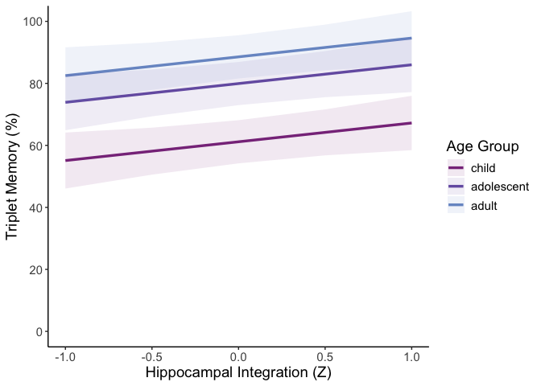

2_integration
================
2026-02-02

# Integration analyses:

## Having identified age differences in neural integration via searchlight and non-parametric permutation testing approaches, here we test the effect of integration on memory

``` r
data <- read.csv('data/master_rsa_merged.csv')
```

``` r
# start with full model, pare down non-significant effects
# effect does not vary or interact with comparison (AB, AC), suggesting general effect of integration on behavior independent of scale
# as such, primary age difference is in which comparison is actually being integrated, not the consequence of such integration on memory

m <- lmer(triplet_accuracy ~ age_group * difference * comparison + (1|subject), data = data)
summary(m)
```

    ## Linear mixed model fit by REML. t-tests use Satterthwaite's method [
    ## lmerModLmerTest]
    ## Formula: triplet_accuracy ~ age_group * difference * comparison + (1 |  
    ##     subject)
    ##    Data: data
    ## 
    ## REML criterion at convergence: -327.1
    ## 
    ## Scaled residuals: 
    ##     Min      1Q  Median      3Q     Max 
    ## -3.7765 -0.4222  0.0790  0.4236  2.3993 
    ## 
    ## Random effects:
    ##  Groups   Name        Variance Std.Dev.
    ##  subject  (Intercept) 0.03368  0.1835  
    ##  Residual             0.02589  0.1609  
    ## Number of obs: 720, groups:  subject, 90
    ## 
    ## Fixed effects:
    ##                                          Estimate Std. Error         df t value
    ## (Intercept)                             7.998e-01  3.662e-02  1.032e+02  21.839
    ## age_groupadult                          8.617e-02  5.186e-02  1.037e+02   1.662
    ## age_groupchild                         -1.958e-01  5.189e-02  1.039e+02  -3.773
    ## difference                              4.667e-02  6.740e-02  6.390e+02   0.692
    ## comparisonAC                            5.038e-05  2.090e-02  6.213e+02   0.002
    ## age_groupadult:difference               2.881e-02  9.444e-02  6.388e+02   0.305
    ## age_groupchild:difference               1.253e-01  9.144e-02  6.366e+02   1.370
    ## age_groupadult:comparisonAC             6.091e-04  2.976e-02  6.214e+02   0.020
    ## age_groupchild:comparisonAC             1.029e-02  2.974e-02  6.214e+02   0.346
    ## difference:comparisonAC                -1.064e-01  9.921e-02  6.309e+02  -1.072
    ## age_groupadult:difference:comparisonAC  1.075e-01  1.404e-01  6.315e+02   0.765
    ## age_groupchild:difference:comparisonAC -5.013e-02  1.343e-01  6.316e+02  -0.373
    ##                                        Pr(>|t|)    
    ## (Intercept)                             < 2e-16 ***
    ## age_groupadult                         0.099600 .  
    ## age_groupchild                         0.000268 ***
    ## difference                             0.488986    
    ## comparisonAC                           0.998077    
    ## age_groupadult:difference              0.760378    
    ## age_groupchild:difference              0.171221    
    ## age_groupadult:comparisonAC            0.983678    
    ## age_groupchild:comparisonAC            0.729487    
    ## difference:comparisonAC                0.284117    
    ## age_groupadult:difference:comparisonAC 0.444426    
    ## age_groupchild:difference:comparisonAC 0.709070    
    ## ---
    ## Signif. codes:  0 '***' 0.001 '**' 0.01 '*' 0.05 '.' 0.1 ' ' 1
    ## 
    ## Correlation of Fixed Effects:
    ##             (Intr) ag_grpd ag_grpc dffrnc cmprAC ag_grpd: ag_grpc: ag_grpd:AC
    ## age_gropdlt -0.706                                                           
    ## age_grpchld -0.706  0.498                                                    
    ## difference  -0.047  0.034   0.034                                            
    ## comparisnAC -0.286  0.202   0.202   0.085                                    
    ## ag_grpdlt:d  0.034 -0.066  -0.024  -0.714 -0.061                             
    ## ag_grpchld:  0.035 -0.025  -0.071  -0.737 -0.063  0.526                      
    ## ag_grpdl:AC  0.201 -0.288  -0.142  -0.060 -0.702  0.112    0.044             
    ## ag_grpch:AC  0.201 -0.142  -0.290  -0.060 -0.703  0.043    0.125    0.493    
    ## dffrnc:cmAC  0.031 -0.022  -0.022  -0.661 -0.004  0.472    0.487    0.003    
    ## ag_grpd::AC -0.022  0.042   0.016   0.467  0.003 -0.638   -0.344   -0.101    
    ## ag_grpc::AC -0.023  0.016   0.048   0.488  0.003 -0.348   -0.670   -0.002    
    ##             ag_grpc:AC dff:AC ag_grpd::AC
    ## age_gropdlt                              
    ## age_grpchld                              
    ## difference                               
    ## comparisnAC                              
    ## ag_grpdlt:d                              
    ## ag_grpchld:                              
    ## ag_grpdl:AC                              
    ## ag_grpch:AC                              
    ## dffrnc:cmAC  0.003                       
    ## ag_grpd::AC -0.002     -0.707            
    ## ag_grpc::AC -0.026     -0.739  0.522

``` r
m <- lmer(triplet_accuracy ~ age_group + difference + comparison +
            age_group:difference + age_group:comparison + difference:comparison + (1|subject), data = data)
summary(m)
```

    ## Linear mixed model fit by REML. t-tests use Satterthwaite's method [
    ## lmerModLmerTest]
    ## Formula: 
    ## triplet_accuracy ~ age_group + difference + comparison + age_group:difference +  
    ##     age_group:comparison + difference:comparison + (1 | subject)
    ##    Data: data
    ## 
    ## REML criterion at convergence: -330.3
    ## 
    ## Scaled residuals: 
    ##     Min      1Q  Median      3Q     Max 
    ## -3.7814 -0.4249  0.0783  0.4217  2.4014 
    ## 
    ## Random effects:
    ##  Groups   Name        Variance Std.Dev.
    ##  subject  (Intercept) 0.03357  0.1832  
    ##  Residual             0.02587  0.1609  
    ## Number of obs: 720, groups:  subject, 90
    ## 
    ## Fixed effects:
    ##                               Estimate Std. Error         df t value Pr(>|t|)
    ## (Intercept)                  8.000e-01  3.656e-02  1.031e+02  21.880  < 2e-16
    ## age_groupadult               8.421e-02  5.174e-02  1.034e+02   1.627 0.106702
    ## age_groupchild              -1.942e-01  5.176e-02  1.035e+02  -3.753 0.000289
    ## difference                   4.009e-02  5.638e-02  6.408e+02   0.711 0.477282
    ## comparisonAC                 3.720e-05  2.089e-02  6.233e+02   0.002 0.998580
    ## age_groupadult:difference    7.340e-02  7.265e-02  6.452e+02   1.010 0.312763
    ## age_groupchild:difference    1.017e-01  6.790e-02  6.381e+02   1.499 0.134493
    ## age_groupadult:comparisonAC  4.503e-03  2.955e-02  6.232e+02   0.152 0.878917
    ## age_groupchild:comparisonAC  9.539e-03  2.972e-02  6.234e+02   0.321 0.748320
    ## difference:comparisonAC     -9.169e-02  5.547e-02  6.339e+02  -1.653 0.098813
    ##                                
    ## (Intercept)                 ***
    ## age_groupadult                 
    ## age_groupchild              ***
    ## difference                     
    ## comparisonAC                   
    ## age_groupadult:difference      
    ## age_groupchild:difference      
    ## age_groupadult:comparisonAC    
    ## age_groupchild:comparisonAC    
    ## difference:comparisonAC     .  
    ## ---
    ## Signif. codes:  0 '***' 0.001 '**' 0.01 '*' 0.05 '.' 0.1 ' ' 1
    ## 
    ## Correlation of Fixed Effects:
    ##             (Intr) ag_grpd ag_grpc dffrnc cmprAC ag_grpd: ag_grpc: ag_grpd:AC
    ## age_gropdlt -0.706                                                           
    ## age_grpchld -0.706  0.499                                                    
    ## difference  -0.040  0.019   0.015                                            
    ## comparisnAC -0.286  0.202   0.202   0.099                                    
    ## ag_grpdlt:d  0.025 -0.051  -0.017  -0.638 -0.076                             
    ## ag_grpchld:  0.026 -0.019  -0.053  -0.663 -0.081  0.518                      
    ## ag_grpdl:AC  0.201 -0.285  -0.144  -0.035 -0.707  0.063    0.059             
    ## ag_grpch:AC  0.201 -0.142  -0.289  -0.060 -0.703  0.053    0.144    0.499    
    ## dffrnc:cmAC  0.018  0.008   0.016  -0.442 -0.002  0.030   -0.013   -0.077    
    ##             ag_grpc:AC
    ## age_gropdlt           
    ## age_grpchld           
    ## difference            
    ## comparisnAC           
    ## ag_grpdlt:d           
    ## ag_grpchld:           
    ## ag_grpdl:AC           
    ## ag_grpch:AC           
    ## dffrnc:cmAC -0.020

``` r
# omitted additional model comparisons here, but no iteration results in significant interaction effects


# final model
m <- lmer(triplet_accuracy ~ age_group + difference + comparison + (1|subject), data = data)
summary(m)
```

    ## Linear mixed model fit by REML. t-tests use Satterthwaite's method [
    ## lmerModLmerTest]
    ## Formula: triplet_accuracy ~ age_group + difference + comparison + (1 |  
    ##     subject)
    ##    Data: data
    ## 
    ## REML criterion at convergence: -347.2
    ## 
    ## Scaled residuals: 
    ##     Min      1Q  Median      3Q     Max 
    ## -3.8503 -0.4363  0.0785  0.4204  2.5345 
    ## 
    ## Random effects:
    ##  Groups   Name        Variance Std.Dev.
    ##  subject  (Intercept) 0.03339  0.1827  
    ##  Residual             0.02589  0.1609  
    ## Number of obs: 720, groups:  subject, 90
    ## 
    ## Fixed effects:
    ##                  Estimate Std. Error         df t value Pr(>|t|)    
    ## (Intercept)      0.799432   0.035462  92.269854  22.543  < 2e-16 ***
    ## age_groupadult   0.086153   0.049430  87.086870   1.743 0.084875 .  
    ## age_groupchild  -0.187785   0.049418  87.007281  -3.800 0.000268 ***
    ## difference       0.060592   0.028255 646.268982   2.145 0.032365 *  
    ## comparisonAC     0.002828   0.012066 628.255418   0.234 0.814773    
    ## ---
    ## Signif. codes:  0 '***' 0.001 '**' 0.01 '*' 0.05 '.' 0.1 ' ' 1
    ## 
    ## Correlation of Fixed Effects:
    ##             (Intr) ag_grpd ag_grpc dffrnc
    ## age_gropdlt -0.696                       
    ## age_grpchld -0.697  0.500                
    ## difference  -0.021 -0.023  -0.007        
    ## comparisnAC -0.170 -0.002  -0.001   0.109

``` r
age_colors <- c("child" = "#883689", "adolescent" = "#765fb0", "adult" = "#7998cc")

# generate predictions from the model for plotting
# marginal effects of difference, moderated by age_group
pred <- ggpredict(m, terms = c("difference", "age_group"))

ggplot(pred, aes(x = x, y = predicted, color = group, fill = group)) +
  # omitting points for this plot; because % accuracy has only 32 possible values, plotting points looks messy
  #geom_point(data = data, aes(x = difference, y = triplet_accuracy, color = age_group), alpha = 0.4, inherit.aes = FALSE) +
  geom_line(linewidth = 1.2) +
  geom_ribbon(aes(ymin = conf.low, ymax = conf.high), alpha = 0.1, color = NA) +
  scale_color_manual(values = age_colors, breaks = c("child", "adolescent", "adult")) +
  scale_fill_manual(values = age_colors, breaks = c("child", "adolescent", "adult")) +
  labs(
    x = "Hippocampal Integration (Z)",
    y = "Triplet Memory (%)",
    color = "Age Group",
    fill = "Age Group"
  ) +
  theme_classic() +
  # scale y axis to percents
  scale_y_continuous(
    labels = function(x) x * 100,
    breaks = seq(0, 1, 0.2) 
  ) +
  # set y axis limits
  coord_cartesian(ylim = c(0, 1)) +
  theme(text = element_text(size = 14))
```

<!-- -->
