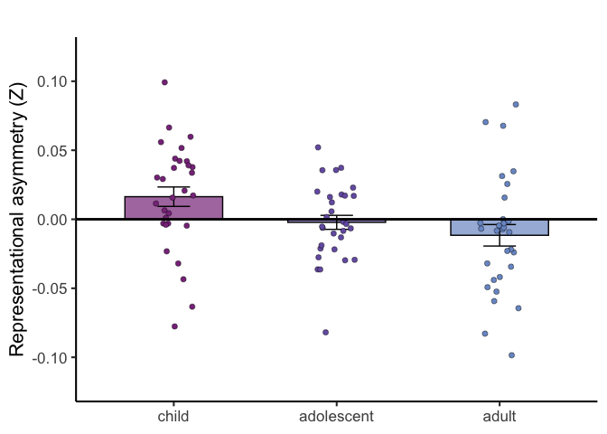
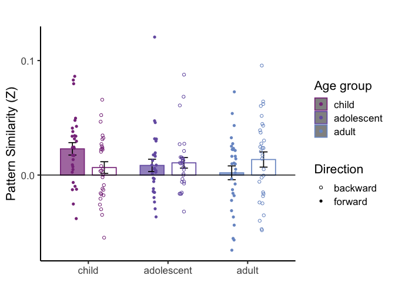

3_symmetry
================
2025-12-17

``` r
master <- read.csv('data/symmetry_data.csv')
# only adjacent items in sequence for symmetry
data <- subset(master, comparison == 'AB')
```

# Symmetry analyses:

## Analyses by hemisphere

``` r
roi <- subset(data, roi %in% c("func-r_hip", "func-l_hip"))
roi$age_group <- relevel(factor(roi$age_group), ref = 'adult')
m <- lmer(asymmetry ~ age_group * roi +  (1|subject), data = roi)
summary(m)
```

    ## Linear mixed model fit by REML. t-tests use Satterthwaite's method [
    ## lmerModLmerTest]
    ## Formula: asymmetry ~ age_group * roi + (1 | subject)
    ##    Data: roi
    ## 
    ## REML criterion at convergence: -1735.2
    ## 
    ## Scaled residuals: 
    ##     Min      1Q  Median      3Q     Max 
    ## -3.3779 -0.6441 -0.0287  0.6139  4.0007 
    ## 
    ## Random effects:
    ##  Groups   Name        Variance  Std.Dev.
    ##  subject  (Intercept) 0.0003117 0.01765 
    ##  Residual             0.0046999 0.06856 
    ## Number of obs: 720, groups:  subject, 90
    ## 
    ## Fixed effects:
    ##                                     Estimate Std. Error         df t value
    ## (Intercept)                        -0.011606   0.007039 224.530559  -1.649
    ## age_groupadolescent                 0.009369   0.009955 224.530559   0.941
    ## age_groupchild                      0.027970   0.009955 224.530559   2.810
    ## roifunc-r_hip                       0.013415   0.008850 626.999999   1.516
    ## age_groupadolescent:roifunc-r_hip  -0.014654   0.012516 626.999999  -1.171
    ## age_groupchild:roifunc-r_hip       -0.027780   0.012516 626.999999  -2.219
    ##                                   Pr(>|t|)   
    ## (Intercept)                         0.1006   
    ## age_groupadolescent                 0.3476   
    ## age_groupchild                      0.0054 **
    ## roifunc-r_hip                       0.1301   
    ## age_groupadolescent:roifunc-r_hip   0.2421   
    ## age_groupchild:roifunc-r_hip        0.0268 * 
    ## ---
    ## Signif. codes:  0 '***' 0.001 '**' 0.01 '*' 0.05 '.' 0.1 ' ' 1
    ## 
    ## Correlation of Fixed Effects:
    ##             (Intr) ag_grpd ag_grpc rfnc-_ ag_grpd:-_
    ## ag_grpdlscn -0.707                                  
    ## age_grpchld -0.707  0.500                           
    ## roifnc-r_hp -0.629  0.445   0.445                   
    ## ag_grpdl:-_  0.445 -0.629  -0.314  -0.707           
    ## ag_grpch:-_  0.445 -0.314  -0.629  -0.707  0.500

## Follow-up within left hemisphere

``` r
roi <- subset(data, roi == "func-l_hip")
roi$age_group <- relevel(factor(roi$age_group), ref = 'adult')
m <- lmer(asymmetry ~ age_group  +  (1|subject), data = roi)
summary(m)
```

    ## Linear mixed model fit by REML. t-tests use Satterthwaite's method [
    ## lmerModLmerTest]
    ## Formula: asymmetry ~ age_group + (1 | subject)
    ##    Data: roi
    ## 
    ## REML criterion at convergence: -853.4
    ## 
    ## Scaled residuals: 
    ##     Min      1Q  Median      3Q     Max 
    ## -3.6125 -0.6255 -0.0043  0.6060  3.8469 
    ## 
    ## Random effects:
    ##  Groups   Name        Variance  Std.Dev.
    ##  subject  (Intercept) 9.178e-05 0.00958 
    ##  Residual             5.064e-03 0.07116 
    ## Number of obs: 360, groups:  subject, 90
    ## 
    ## Fixed effects:
    ##                      Estimate Std. Error        df t value Pr(>|t|)   
    ## (Intercept)         -0.011606   0.006727 86.999998  -1.725   0.0881 . 
    ## age_groupadolescent  0.009369   0.009514 86.999998   0.985   0.3275   
    ## age_groupchild       0.027970   0.009514 86.999998   2.940   0.0042 **
    ## ---
    ## Signif. codes:  0 '***' 0.001 '**' 0.01 '*' 0.05 '.' 0.1 ' ' 1
    ## 
    ## Correlation of Fixed Effects:
    ##             (Intr) ag_grpd
    ## ag_grpdlscn -0.707        
    ## age_grpchld -0.707  0.500

``` r
m <- lmer(asymmetry ~ age + (1|subject), data = roi)
summary(m)
```

    ## Linear mixed model fit by REML. t-tests use Satterthwaite's method [
    ## lmerModLmerTest]
    ## Formula: asymmetry ~ age + (1 | subject)
    ##    Data: roi
    ## 
    ## REML criterion at convergence: -851.5
    ## 
    ## Scaled residuals: 
    ##     Min      1Q  Median      3Q     Max 
    ## -3.4561 -0.6267 -0.0126  0.6362  3.9166 
    ## 
    ## Random effects:
    ##  Groups   Name        Variance Std.Dev.
    ##  subject  (Intercept) 0.000138 0.01175 
    ##  Residual             0.005064 0.07116 
    ## Number of obs: 360, groups:  subject, 90
    ## 
    ## Fixed effects:
    ##               Estimate Std. Error         df t value Pr(>|t|)  
    ## (Intercept)  0.0188362  0.0091165 87.9999991   2.066   0.0418 *
    ## age         -0.0012510  0.0005712 87.9999991  -2.190   0.0312 *
    ## ---
    ## Signif. codes:  0 '***' 0.001 '**' 0.01 '*' 0.05 '.' 0.1 ' ' 1
    ## 
    ## Correlation of Fixed Effects:
    ##     (Intr)
    ## age -0.901

### Plot symmetry analysis above

``` r
summary_data <- data %>%
  group_by(subject, age_group, roi, comparison) %>%
  summarize(across(where(is.numeric), mean, na.rm = TRUE), .groups = "drop")
```

    ## Warning: There was 1 warning in `summarize()`.
    ## ℹ In argument: `across(where(is.numeric), mean, na.rm = TRUE)`.
    ## ℹ In group 1: `subject = "temple016"`, `age_group = "adult"`, `roi =
    ##   "func-b_hip"`, `comparison = "AB"`.
    ## Caused by warning:
    ## ! The `...` argument of `across()` is deprecated as of dplyr 1.1.0.
    ## Supply arguments directly to `.fns` through an anonymous function instead.
    ## 
    ##   # Previously
    ##   across(a:b, mean, na.rm = TRUE)
    ## 
    ##   # Now
    ##   across(a:b, \(x) mean(x, na.rm = TRUE))

``` r
roi <- subset(summary_data, roi == 'func-l_hip')
roi <- roi %>%
  mutate(age_group = factor(age_group, levels = c('child', 'adolescent', 'adult')))
# run 1 sample t-test for integration > 0 and plot results
plot_df <- roi %>%
  group_by(age_group) %>%
  summarise(
    n        = sum(!is.na(asymmetry)),
    mean_val = mean(asymmetry, na.rm = TRUE),
    se       = sd(asymmetry, na.rm = TRUE) / sqrt(n),
    p_value  = {
      vals <- asymmetry[!is.na(asymmetry)]
      if (length(vals) > 1) t.test(vals, alternative = "greater", mu = 0)$p.value else NA_real_
    },
    .groups = "drop"
  ) %>%
  mutate(
    sig = case_when(
      !is.na(p_value) & p_value < 0.05 ~ "*",
      !is.na(p_value) & p_value < 0.10 ~ "~",
      TRUE ~ ""
    ),
    star_y = mean_val + se + 0.03
  )

ggplot(plot_df, aes(x = age_group, y = mean_val, fill = age_group)) +
  # bars
  geom_col(width = 0.6, color = "black", alpha = 0.7) +
  # error bars
  geom_errorbar(
    aes(ymin = mean_val - se, ymax = mean_val + se),
    width = 0.2
  ) +
  # raw points
  geom_point(
    data = roi,
    aes(x = age_group, y = asymmetry),
    inherit.aes = TRUE,
    position = position_jitter(width = 0.12, height = 0),
    shape = 21, size = 2, alpha = 1.0, stroke = 0.2
  ) +
  geom_hline(yintercept = 0, color = "black", linewidth = 1) +
  scale_fill_manual(values = c(
    "child"     = "#883689",
    "adolescent"   = "#765fb0",
    "adult"     = "#7998cc"
  )) +
  labs(
    x = NULL,
    y = "Representational asymmetry (Z)",
    title = ""
  ) +
  theme_classic(base_size = 16) +
  theme(panel.border = element_blank()) +
  theme(
    legend.position = "none",
    plot.title = element_text(hjust = 0.5, size = 16, face = "bold")
  ) + ylim(c(-0.12, 0.12))
```

<!-- -->

### Directional integration analyses

``` r
long_roi <- roi %>%
  pivot_longer(cols = c(forward, backward, asymmetry),
               names_to = "condition",
               values_to = "value")

plot_long <- long_roi %>%
  group_by(age_group, condition) %>%
  summarise(
    mean_val = mean(value),
    se = sd(value) / sqrt(n()),
    ttest = list(t.test(value, alternative = "greater", mu = 0)),
    .groups = "drop"
  ) %>%
  mutate(
    p_value = sapply(ttest, function(x) x$p.value),
    sig = case_when(
      p_value < 0.05 ~ "*",
      p_value < 0.1  ~ "~",
      TRUE ~ ""
    )
  )
plot_long
```

    ## # A tibble: 9 × 7
    ##   age_group  condition mean_val      se ttest    p_value sig  
    ##   <fct>      <chr>        <dbl>   <dbl> <list>     <dbl> <chr>
    ## 1 child      asymmetry  0.0164  0.00703 <htest> 0.0136   "*"  
    ## 2 child      backward   0.00653 0.00510 <htest> 0.105    ""   
    ## 3 child      forward    0.0229  0.00541 <htest> 0.000107 "*"  
    ## 4 adolescent asymmetry -0.00224 0.00507 <htest> 0.669    ""   
    ## 5 adolescent backward   0.0107  0.00462 <htest> 0.0142   "*"  
    ## 6 adolescent forward    0.00841 0.00539 <htest> 0.0647   "~"  
    ## 7 adult      asymmetry -0.0116  0.00778 <htest> 0.927    ""   
    ## 8 adult      backward   0.0136  0.00665 <htest> 0.0253   "*"  
    ## 9 adult      forward    0.00196 0.00602 <htest> 0.374    ""

### Plot directional integration by age group

``` r
plot_long2 <- plot_long %>% filter(condition %in% c("forward","backward"))
long_roi2  <- long_roi  %>% filter(condition %in% c("forward","backward"))

# factor order
plot_long2$age_group <- factor(plot_long2$age_group, levels = c("child","adolescent","adult"))
long_roi2$age_group  <- factor(long_roi2$age_group,  levels = levels(plot_long2$age_group))

# age colors
age_cols <- c(child = "#883689", adolescent = "#765fb0", adult = "#7998cc")

# fill color: forward = age color; backward = white
plot_long2 <- plot_long2 %>%
  mutate(fill_color = ifelse(condition == "forward",
                             age_cols[as.character(age_group)],
                             "white"))
long_roi2 <- long_roi2 %>%
  mutate(fill_color = ifelse(condition == "forward",
                             age_cols[as.character(age_group)],
                             "white"))

pos <- position_dodge(width = 0.8)

plot_long2 <- plot_long2 %>%
  mutate(condition = factor(condition, levels = c("forward", "backward")))

ggplot(plot_long2, aes(x = age_group, y = mean_val)) +
  geom_bar(aes(fill = fill_color, color = age_group, group = condition),
           stat = "identity", position = pos, width = 0.6, linewidth = 0.6, alpha = 0.7) +
  geom_errorbar(aes(ymin = mean_val - se, ymax = mean_val + se,
                    group = condition),
                position = pos, width = 0.2, linewidth = 0.6, color = "black") +
  # subject-level points from roi df
  geom_point(
    data = long_roi2,
    aes(x = age_group, y = value, 
        color = age_group, shape = condition, group = condition),
    position = position_jitterdodge(jitter.width = 0.15, dodge.width = -0.7),
    size = 1.5, alpha = 1.0,
    inherit.aes = TRUE
  ) + 
  geom_hline(yintercept = 0, color = 'black') +
  scale_fill_identity(guide = "none") +
  scale_color_manual(values = age_cols, name = "Age group") +
  scale_shape_manual(values = c(forward = 16, backward = 1),
                     name = "Direction") +
  scale_y_continuous(breaks = seq(-1, 1, by = 0.1)) +
  labs(x = NULL, y = "Pattern Similarity (Z)", title = "") +
  theme_classic(base_size = 16) +
  theme(
    panel.border = element_blank(),
    legend.position = "right"
  )
```

    ## Warning: `position_jitterdodge()` requires non-overlapping x intervals.

<!-- -->
