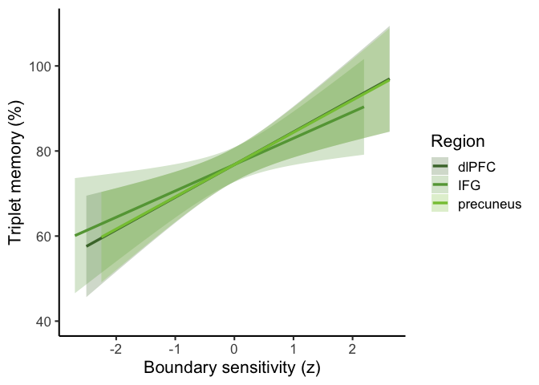
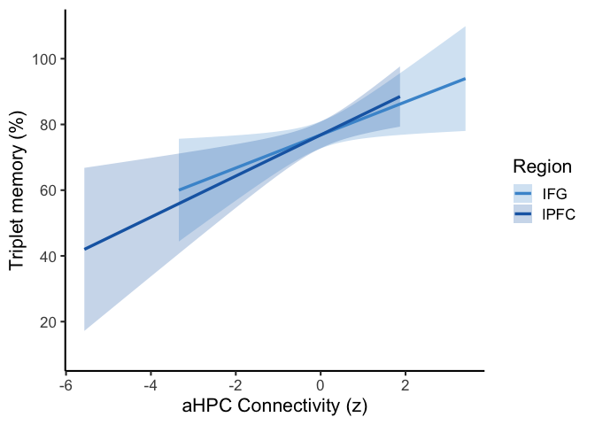

4_timeseries
================
2025-12-18

``` r
data <- read.csv('data/timeseries_data.csv')

# sensitivity/connectivity values in these ROIs are parametrically associated with age, so we control for age (continuous) to assess effect on behavior
```

# Timeseries analyses

## boundary sensitivity ~ behavior

``` r
m <- lm(accuracy ~ age + dlpfc_univ, data = data)
summary(m)
```

    ## 
    ## Call:
    ## lm(formula = accuracy ~ age + dlpfc_univ, data = data)
    ## 
    ## Residuals:
    ##      Min       1Q   Median       3Q      Max 
    ## -0.38178 -0.15162 -0.00047  0.13382  0.34534 
    ## 
    ## Coefficients:
    ##              Estimate Std. Error t value Pr(>|t|)    
    ## (Intercept) 0.6369064  0.0502371  12.678  < 2e-16 ***
    ## age         0.0087763  0.0032464   2.703  0.00825 ** 
    ## dlpfc_univ  0.0010929  0.0003213   3.402  0.00101 ** 
    ## ---
    ## Signif. codes:  0 '***' 0.001 '**' 0.01 '*' 0.05 '.' 0.1 ' ' 1
    ## 
    ## Residual standard error: 0.1901 on 87 degrees of freedom
    ## Multiple R-squared:  0.2815, Adjusted R-squared:  0.265 
    ## F-statistic: 17.04 on 2 and 87 DF,  p-value: 5.691e-07

``` r
m <- lm(accuracy ~ age + b_ifg_univ, data = data)
summary(m)
```

    ## 
    ## Call:
    ## lm(formula = accuracy ~ age + b_ifg_univ, data = data)
    ## 
    ## Residuals:
    ##      Min       1Q   Median       3Q      Max 
    ## -0.39036 -0.15204  0.02581  0.15668  0.37442 
    ## 
    ## Coefficients:
    ##              Estimate Std. Error t value Pr(>|t|)    
    ## (Intercept) 0.6126372  0.0502391  12.194  < 2e-16 ***
    ## age         0.0092028  0.0034592   2.660  0.00929 ** 
    ## b_ifg_univ  0.0010547  0.0004097   2.574  0.01174 *  
    ## ---
    ## Signif. codes:  0 '***' 0.001 '**' 0.01 '*' 0.05 '.' 0.1 ' ' 1
    ## 
    ## Residual standard error: 0.1951 on 87 degrees of freedom
    ## Multiple R-squared:  0.2435, Adjusted R-squared:  0.2261 
    ## F-statistic:    14 on 2 and 87 DF,  p-value: 5.341e-06

``` r
m <- lm(accuracy ~ age + precuneus_univ, data = data)
summary(m)
```

    ## 
    ## Call:
    ## lm(formula = accuracy ~ age + precuneus_univ, data = data)
    ## 
    ## Residuals:
    ##      Min       1Q   Median       3Q      Max 
    ## -0.38879 -0.15464  0.01417  0.14811  0.45858 
    ## 
    ## Coefficients:
    ##                 Estimate Std. Error t value Pr(>|t|)    
    ## (Intercept)    0.6044842  0.0472484  12.794  < 2e-16 ***
    ## age            0.0093308  0.0031660   2.947 0.004115 ** 
    ## precuneus_univ 0.0007612  0.0002210   3.444 0.000884 ***
    ## ---
    ## Signif. codes:  0 '***' 0.001 '**' 0.01 '*' 0.05 '.' 0.1 ' ' 1
    ## 
    ## Residual standard error: 0.1898 on 87 degrees of freedom
    ## Multiple R-squared:  0.2836, Adjusted R-squared:  0.2671 
    ## F-statistic: 17.22 on 2 and 87 DF,  p-value: 5.011e-07

## plot boundary sensitivity ~ behavior

``` r
data_z <- data %>%
  mutate(
    dlpfc_z = as.numeric(scale(dlpfc_univ)),
    ifg_z = as.numeric(scale(b_ifg_univ)),
    precuneus_z = as.numeric(scale(precuneus_univ)))

m_dlpfc <- lm(accuracy ~ age + dlpfc_z, data = data_z)
m_ifg <- lm(accuracy ~ age + ifg_z, data = data_z)
m_precuneus <- lm(accuracy ~ age + precuneus_z, data = data_z)

# prediction helper function (use for ppi plotting as well)
mean_age <- mean(data_z$age, na.rm = TRUE)
make_pred <- function(model, xvar, label) {
  xseq <- seq(
    min(data_z[[xvar]], na.rm = TRUE),
    max(data_z[[xvar]], na.rm = TRUE),
    length.out = 100)

  newdata <- data.frame(
    age = rep(mean_age, length(xseq)))
  newdata[[xvar]] <- xseq

  preds <- predict(model, newdata, interval = "confidence")

  data.frame(
    boundary_sensitivity_z = xseq,
    fit = preds[, "fit"],
    lwr = preds[, "lwr"],
    upr = preds[, "upr"],
    region = label)
}

pred_df <- bind_rows(
  make_pred(m_dlpfc, "dlpfc_z", "dlPFC"),
  make_pred(m_ifg, "ifg_z", "IFG"),
  make_pred(m_precuneus, "precuneus_z", "precuneus"))

ggplot(pred_df,
       aes(x = boundary_sensitivity_z,
           y = fit,
           color = region,
           fill  = region)) +
  geom_ribbon(aes(ymin = lwr, ymax = upr),
              alpha = 0.25, color = NA) +
  geom_line(linewidth = 1.2) +
  scale_color_manual(values = c(
    "dlPFC" = "#497436",
    "IFG" = "#64A343",
    "precuneus" = "#86C440")) +
  scale_fill_manual(values = c(
    "dlPFC" = "#497436",
    "IFG" = "#64A343",
    "precuneus" = "#86C440")) +
  labs(
    x = "Boundary sensitivity (z)",
    y = "Triplet memory (%)",
    color = "Region",
    fill = "Region") +
  theme_classic(base_size = 16) +
  scale_y_continuous(
    labels = label_number(scale = 100, accuracy = 1),
    limits = c(0.4, 1.1))
```

<!-- -->

## psychophysiological interaction (functional connectivity) ~ behavior

``` r
m <- lm(accuracy ~ age + ppi_ifg, data = data)
summary(m)
```

    ## 
    ## Call:
    ## lm(formula = accuracy ~ age + ppi_ifg, data = data)
    ## 
    ## Residuals:
    ##      Min       1Q   Median       3Q      Max 
    ## -0.42344 -0.17100  0.02107  0.15941  0.39027 
    ## 
    ## Coefficients:
    ##              Estimate Std. Error t value Pr(>|t|)    
    ## (Intercept) 0.6269768  0.0543253  11.541  < 2e-16 ***
    ## age         0.0109099  0.0032644   3.342  0.00123 ** 
    ## ppi_ifg     0.0016818  0.0007594   2.214  0.02941 *  
    ## ---
    ## Signif. codes:  0 '***' 0.001 '**' 0.01 '*' 0.05 '.' 0.1 ' ' 1
    ## 
    ## Residual standard error: 0.1969 on 87 degrees of freedom
    ## Multiple R-squared:  0.2293, Adjusted R-squared:  0.2116 
    ## F-statistic: 12.95 on 2 and 87 DF,  p-value: 1.198e-05

``` r
m <- lm(accuracy ~ age + ppi_lpfc, data = data)
summary(m)
```

    ## 
    ## Call:
    ## lm(formula = accuracy ~ age + ppi_lpfc, data = data)
    ## 
    ## Residuals:
    ##     Min      1Q  Median      3Q     Max 
    ## -0.4301 -0.1691  0.0219  0.1559  0.4224 
    ## 
    ## Coefficients:
    ##              Estimate Std. Error t value Pr(>|t|)    
    ## (Intercept) 0.6365990  0.0526377  12.094  < 2e-16 ***
    ## age         0.0104132  0.0031796   3.275  0.00152 ** 
    ## ppi_lpfc    0.0009138  0.0003231   2.828  0.00581 ** 
    ## ---
    ## Signif. codes:  0 '***' 0.001 '**' 0.01 '*' 0.05 '.' 0.1 ' ' 1
    ## 
    ## Residual standard error: 0.1937 on 87 degrees of freedom
    ## Multiple R-squared:  0.2544, Adjusted R-squared:  0.2373 
    ## F-statistic: 14.85 on 2 and 87 DF,  p-value: 2.838e-06

### Plot directional integration by age group

``` r
data_z <- data %>%
  mutate(
    lpfc_z = as.numeric(scale(ppi_lpfc)),
    ifg_z = as.numeric(scale(ppi_ifg)))

m_lpfc <- lm(accuracy ~ age + lpfc_z, data = data_z)
m_ifg  <- lm(accuracy ~ age + ifg_z, data = data_z)

pred_df <- bind_rows(
  make_pred(m_lpfc, "lpfc_z", "lPFC"),
  make_pred(m_ifg, "ifg_z", "IFG"))

ggplot(pred_df,
       aes(x = boundary_sensitivity_z,
           y = fit,
           color = region,
           fill  = region)) +
  geom_ribbon(aes(ymin = lwr, ymax = upr),
              alpha = 0.25, color = NA) +
  geom_line(linewidth = 1.2) +
  scale_color_manual(values = c(
    "lPFC" = "#1968B2",
    "IFG" = "#4997D2")) +
  scale_fill_manual(values = c(
    "lPFC" = "#1968B2",
    "IFG" = "#4997D2")) +
  labs(
    x = "aHPC Connectivity (z)",
    y = "Triplet memory (%)",
    color = "Region",
    fill = "Region") +
  theme_classic(base_size = 16) +
  scale_y_continuous(
  labels = label_number(scale = 100, accuracy = 1),
  breaks = seq(0.2, 1, by = 0.2),
  limits = c(0.1, 1.1)
)
```

<!-- -->
