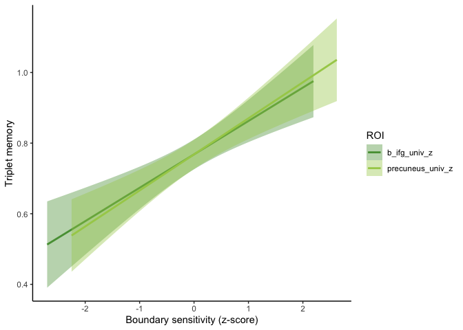
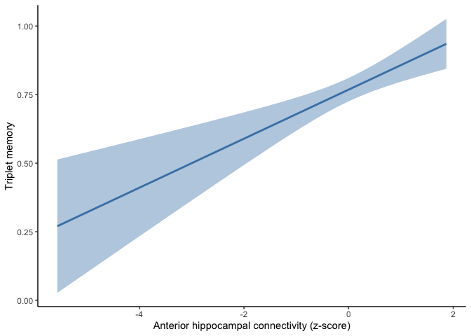

4_timeseries
================
2025-12-18

``` r
data <- read.csv('data/timeseries_data.csv')

# sensitivity/connectivity values in these ROIs are parametrically associated with age, so we control for age (continuous) to assess effect on behavior
```

# Timeseries analyses

## behavior ~ boundary sensitivity/functional connectivity

``` r
# include all ROI's in one master model in case of covariance between multiple ROI's
m <- lm(accuracy ~ age + hip_bound_cope4_clust + dlpfc_univ + b_ifg_univ + precuneus_univ + ang_gyrus_univ + insula_univ + lat_par_univ + parietal_univ + post_cing_univ + ppi_ifg + ppi_dlpfc, data = data)
summary(m)
```

    ## 
    ## Call:
    ## lm(formula = accuracy ~ age + hip_bound_cope4_clust + dlpfc_univ + 
    ##     b_ifg_univ + precuneus_univ + ang_gyrus_univ + insula_univ + 
    ##     lat_par_univ + parietal_univ + post_cing_univ + ppi_ifg + 
    ##     ppi_dlpfc, data = data)
    ## 
    ## Residuals:
    ##      Min       1Q   Median       3Q      Max 
    ## -0.34136 -0.09681  0.00084  0.11784  0.37174 
    ## 
    ## Coefficients:
    ##                         Estimate Std. Error t value Pr(>|t|)    
    ## (Intercept)            6.775e-01  5.461e-02  12.408   <2e-16 ***
    ## age                    5.000e-03  3.576e-03   1.398   0.1661    
    ## hip_bound_cope4_clust -1.157e-04  2.011e-04  -0.575   0.5668    
    ## dlpfc_univ             4.470e-04  3.521e-04   1.270   0.2080    
    ## b_ifg_univ             1.411e-03  5.699e-04   2.475   0.0155 *  
    ## precuneus_univ         8.384e-04  3.441e-04   2.437   0.0171 *  
    ## ang_gyrus_univ         1.569e-03  2.159e-03   0.727   0.4696    
    ## insula_univ           -9.070e-04  5.506e-04  -1.647   0.1036    
    ## lat_par_univ          -3.516e-03  3.393e-03  -1.036   0.3033    
    ## parietal_univ          1.006e-03  1.309e-03   0.769   0.4443    
    ## post_cing_univ         6.961e-05  5.255e-04   0.132   0.8950    
    ## ppi_ifg                1.075e-03  5.126e-04   2.098   0.0392 *  
    ## ppi_dlpfc             -7.692e-04  1.181e-03  -0.651   0.5167    
    ## ---
    ## Signif. codes:  0 '***' 0.001 '**' 0.01 '*' 0.05 '.' 0.1 ' ' 1
    ## 
    ## Residual standard error: 0.1713 on 77 degrees of freedom
    ## Multiple R-squared:  0.4841, Adjusted R-squared:  0.4037 
    ## F-statistic:  6.02 on 12 and 77 DF,  p-value: 2.692e-07

## plot transition sensitivity ~ behavior

``` r
data_plot <- data %>%
  mutate(
    b_ifg_univ_z = scale(b_ifg_univ),
    precuneus_univ_z = scale(precuneus_univ),
    ppi_ifg_z = scale(ppi_ifg)
  )


# Plot 1: IFG and precuneus overlaid (boundary sensitivity)
data_long <- data_plot %>%
  dplyr::select(accuracy, b_ifg_univ_z, precuneus_univ_z) %>%
  pivot_longer(cols = c(b_ifg_univ_z, precuneus_univ_z),
               names_to = "ROI", values_to = "Activation")
ggplot(data_long, aes(x = Activation, y = accuracy, color = ROI, fill = ROI)) +
  geom_smooth(method = "lm", se = TRUE) +
  scale_fill_manual(
    values = c("b_ifg_univ_z" = "#579d42", "precuneus_univ_z" = "#a6cd57")) +
  scale_color_manual(
    values = c("b_ifg_univ_z" = "#579d42", "precuneus_univ_z" = "#a6cd57")) +
  labs(
    x = "Boundary sensitivity (z-score)",
    y = "Triplet memory",
    color = "ROI"
  ) +
  theme_classic()
```

    ## `geom_smooth()` using formula = 'y ~ x'

<!-- -->

``` r
# Plot 2: connectivity with anterior hippocampus (psychophysiological interaction)
# -------------------------
ggplot(data_plot, aes(x = ppi_ifg_z, y = accuracy)) +
  geom_smooth(method = "lm", se = TRUE, color = "steelblue", fill = "steelblue") +
  labs(
    x = "Anterior hippocampal connectivity (z-score)",
    y = "Triplet memory"
  ) +
  theme_classic()
```

    ## `geom_smooth()` using formula = 'y ~ x'

<!-- -->
